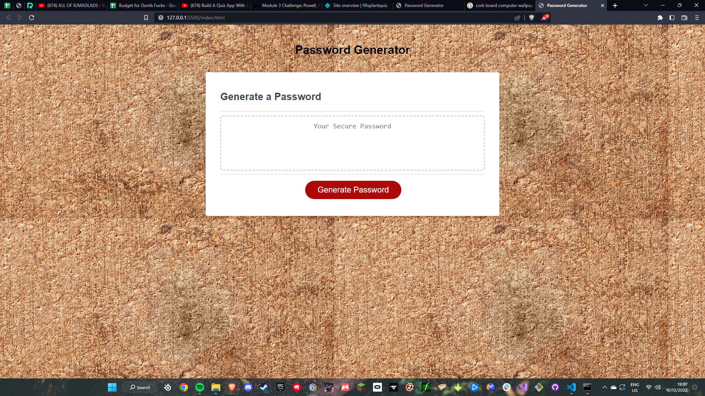

# Module 2 project
## Description
This is a password generator based off of user imputs 
These Imputs are drived by js and run in a popup
## Installation
Run From The Following Link :
https://phoenix-ceri.github.io/passwordgen/
## Usage
follow the prompts and get a new password

## Credits

ucf for the base code

## License

used the MIT licence
---
